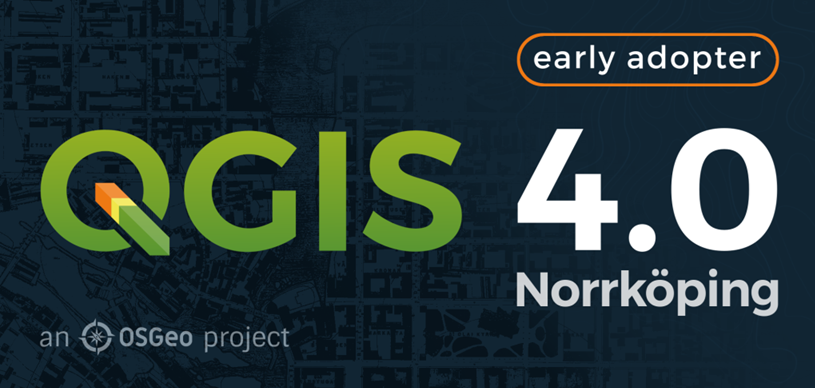
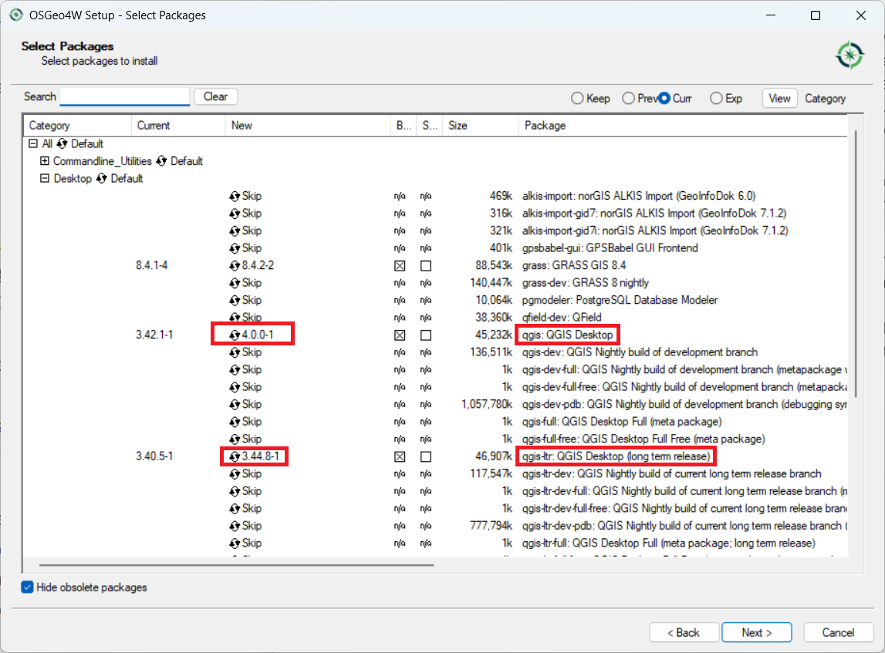
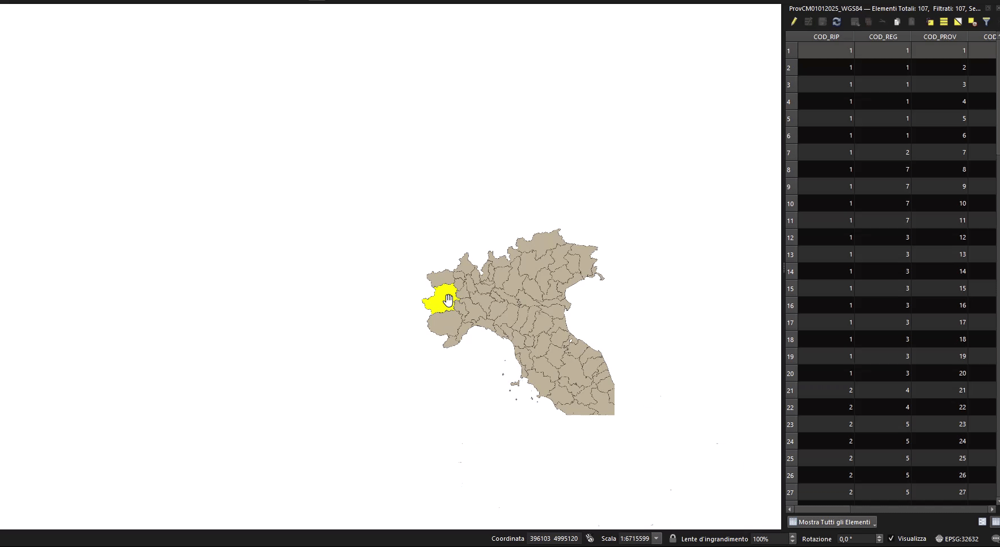

QGIS 4.0 is now available! But yes, you have read my title correctly - I would recommend many people don't upgrade.... yet. 

QGIS 4.0 is an 'Early Adopter' version - which means that there are new things in there that may break. I would also say for many basic users (and some intermediate users) there isn't much new that's changed, so you are not missing out on much (see below for some new things coming up).

Many of the changes for 4.0 are under the hood, so that's why you won't see many differences. These changes are important - and will make the software more reliable and easier to maintain.

Rather than upgrading now, I would recommend waiting until 4.2 is released (about July 2026) and by this point QGIS will be more stable, and it will be fine to upgrade then.

## But I really want to upgrade now

If you are really keen, and if you have used the [OSGeo4W](https://qgis.org/resources/installation-guide/#online-osgeo4w-installer) installer on Windows, then you have the ability to install two versions of QGIS at once. This is the approach I use, to keep both the latest LTR (long term release) and the latest version available on my desktop.
I currently have QGIS 4.0 and QGIS 3.44.8 on my computer. To get this, run the installer and choose from the options below. Cycle through the versions by clicking on the version number until you get 4.0.0-1. or similar under "qgis: QGIS Desktop".

If you have already installed QGIS with the normal installer, and want to switch to the OSGeo4W installer, then you will need to uninstall QGIS first, and then install the OSGeo4W installer. See the [guide](https://qgis.org/resources/installation-guide/#online-osgeo4w-installer) for more information. 

**DO NOT do this if you have a big deadline coming up. It may break your installation of QGIS!**

## What's new in QGIS 4.0?

There is a great [blog post](https://blog.qgis.org/2026/03/09/qgis-4-0-norrkoping-is-released/) on the ins and outs of QGIS version 4.0.

I would say the most important change is moving from Qt5 to Qt6. What is Qt you ask? Qt is the software that is used to make software - in this case QGIS. It provides a framework for the buttons, windows and interfaces that you see. It also allows the software to be cross-platform - so QGIS will run on Windows, macOS or Unix - with minimal changes. 

Qt is widely used and helps create programmes as diverse as Adobe Photoshop Elements, Audacity, FreeCAD, Google Earth, OBS, Teamviewer, Telegram and VLC media player according to  [*Wikipedia*](https://en.wikipedia.org/wiki/Qt_(software)). Qt5 is being retired and Qt6 will now be supported until 2029.

Hopefully this will allow a few underlying bugs in QGIS to be fixed, including some related to macOS, but unfortunately apparently the [bug of saving layers inside a geopackage on a Mac](https://github.com/qgis/QGIS/issues/49351#issuecomment-4046576171) has not changed, yet. 

You can check out the [Visual Changelog](https://qgis.org/project/visual-changelogs/visualchangelog40/) to see all the new features, but one caught my eye - you can now [double click an entry in the attribute table, and QGIS will zoom to it](https://qgis.org/project/visual-changelogs/visualchangelog40/#feature-attribute-table-double-click-zoom):

*Thanks to [Nass](https://github.com/lanckmann) for implementing this.*

## Plugins

It is also worth mentioning that if you use plugins in QGIS, these will need to be updated to work with QGIS 4.0. Many plugin authors have updated their plugins to work with QGIS 4.0, and out of the [top 10 plugins](https://plugins.qgis.org/metabase/public/dashboard/7ecd345f-7321-423d-9844-71e526a454a9), 7 are fully compatible, and 1 - qgis2web - is compatible but has out of date [metadata](https://github.com/qgis2web/qgis2web/issues/1122):

**Top 10 QGIS plugins (as of 18/02/2026):**

Plugin | Compatible
-----  | -----
QuickMapServices| [✓]{style="color:green"}
OpenLayers Plugin |  [✘]{style="color:red"} *QGIS  4.0 not supported, and the plugin is now deprecated, I would suggest you use XYZ Maps in QGIS the browser panel instead* 
QuickOSM| [✓]{style="color:green"}
Semi-Automatic Classification Plugin| [✓]{style="color:green"}
HCMGIS| [✓]{style="color:green"}
mmqgis | [✓]{style="color:green"}
Lat Lon Tools| [✘]{style="color:red"}
Profile tool | [✓]{style="color:green"} 
qgis2web | [✘]{style="color:red"} *compatible, but [metadata to be updated](https://github.com/qgis2web/qgis2web/issues/1122) *
Qgis2threejs |  [✓]{style="color:green"}

Plugins are updated all the time - this is the list at the time of writing, 18/03/2026. If you have a plugin that doesn't work yet - do keep checking back. If you spot anything wrong with my list, [let me know](https://nickbearman.com). 

## QGIS 4.2

So, I said wait for QGIS 4.2 earlier, so when will it be out? The plan is for 4.2 to be released in July 2026, so not too long to wait. Check out the [roadmap](https://qgis.org/resources/roadmap/) for more info.

Thanks for reading, and if you need advice with QGIS, I offer group training, one to one training and consultancy, please [contact me](https://nickbearman.com) for more details!

Happy GIS-ing!

