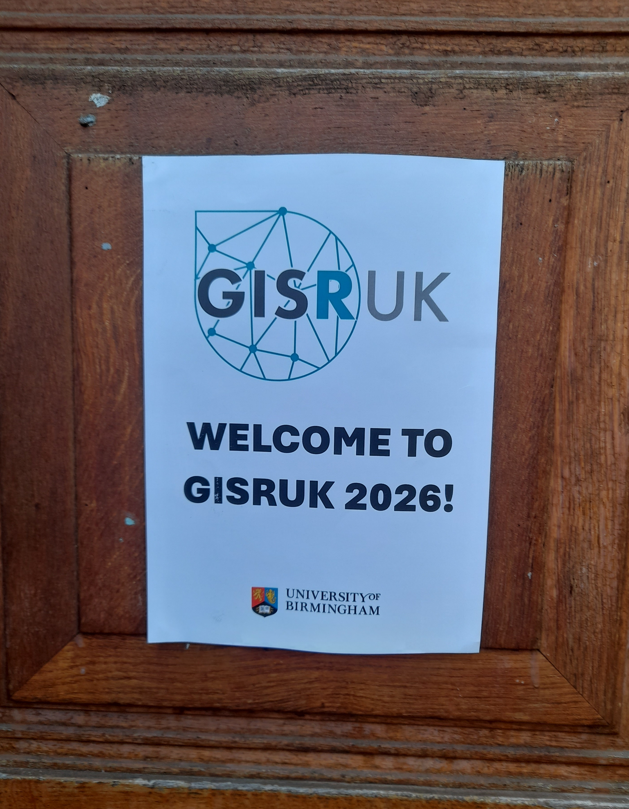
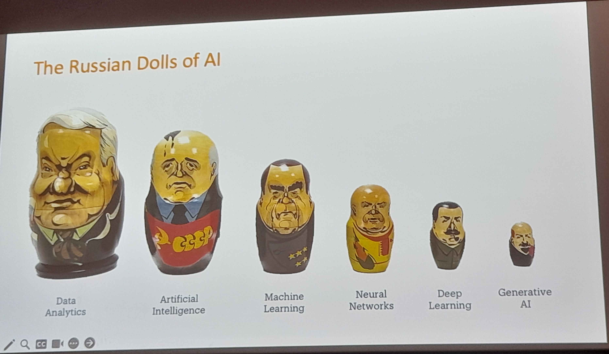
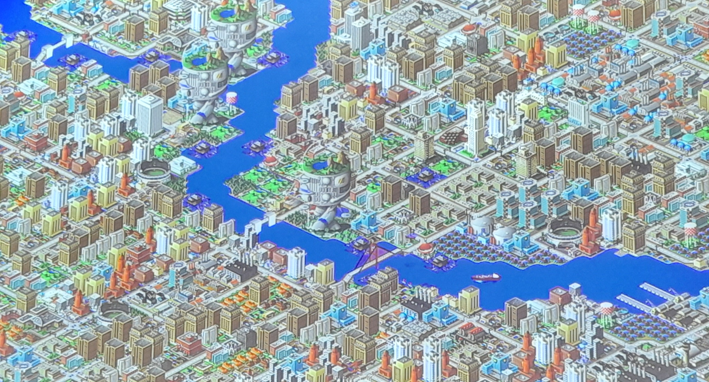
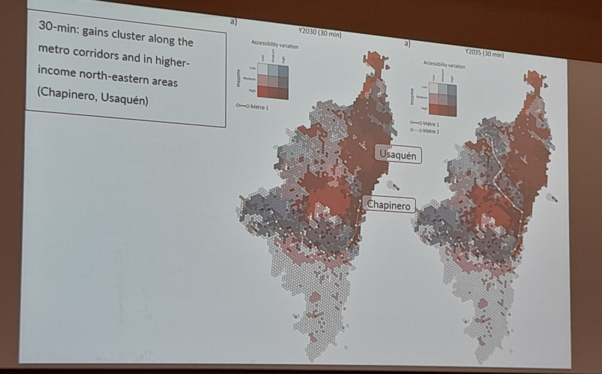
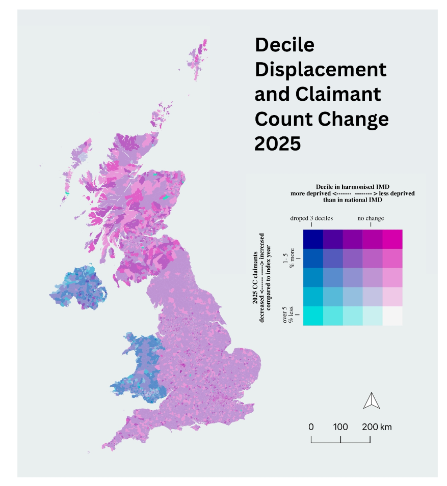
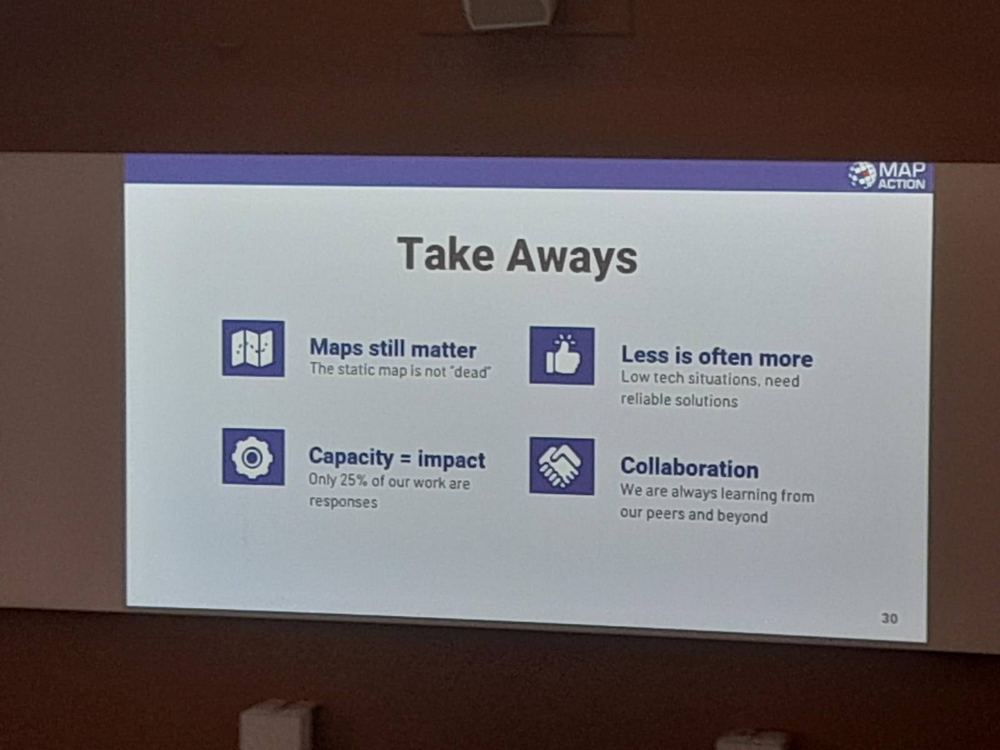
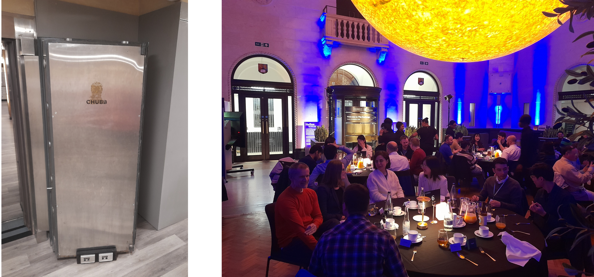
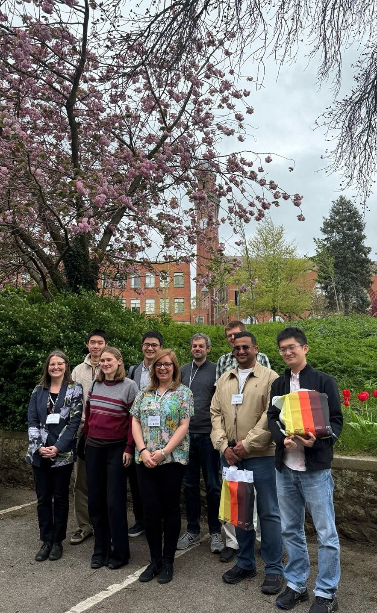

::: columns
:::: {.column width="70%"}

From 14th - 17th April, I was fortunate to be able to attend GISRUK 2026, at the University of Birmingham. GISRUK is a regular feature in my calendar and it's a great opportunity to see what is happening in the world of GIS Research, catch-up with old colleagues and make new connections. 

For me, this conference was quite application focused, which I really enjoyed. It's great to see what GIS can do, as well as learning about new methods and techniques. 

::::
:::: {.column width="5%"}

::::
:::: {.column width="25%"}

::::
:::

Ed Parsons kicked-off the conference with a great keynote, talking about how we, as geographers, can make a difference. He got us thinking about what are the real world problems we can solve - a useful reminder that while the research is important, application is important too. 

I also really loved his Russian Doll AI explanation - while Generative AI is "the new big thing", it is all just statistics and many of these terms (Deep Learning, Neural Networks, Machine Learning and Artificial Intelligence) are all part of Data Analytics - which we have been working with in GIS for many many years. 

We also heard from the conference chairs, Emma Ferranti and Sarah Greenham about their work with [WM Adapt](https://www.birmingham.ac.uk/research/centres-institutes/urban-wellbeing/projects/wm-adapt-maximising-adaptation-to-climate-change-in-the-west-midland-beyond) and wider applications in their current research projects. 

This was followed by two great presentations from [Adam Nudds](https://www.linkedin.com/in/adam-nudds-01a091106/) and [Si Chan Lam](https://www.linkedin.com/in/sichunlam/) at the West Midlands Combined Authority (WMCA). Adam is a graduate of Uni of Birmingham, and part of the great links the university has with local government. Si reflected on how his many hundreds of hours playing Sim City 2000 prepared him for a role in Local Government (!) 

With Adam, he provided some great food for thought on how we as GIS Researchers can make GIS more accessible and useful to decision makers. Often they want two sentences - but they also want confidence in the research behind those two sentences. PowerBI as a business tool also cropped up a couple of times with the tension of decision makers and non geospatial analysts wanting to use PowerBI, and the GIS experts wanting to use a more full featured GIS. I would say both tools can be useful and it's worth seeing how we can bridge the two. Si and Adam are trying to make a showcase of GIS tools to show what we can do with GIS for the decision makers in WMCA. 

It was also great to hear critical thinking mentioned several times, when using data, particularly IMD. Many many studies use IMD, particularly when they are looking at impacts on people. However, not many critically evaluate their use of it. Fortunately, Emma Ferranti reminded us in her presentation that when they use it, they ask - does it provide enough information and does it identify the people it needs to? Also [Luc Wilson](https://doi.org/10.5281/zenodo.19367359) reminded us that IMD is often treated like fact, but it isn't necessarily fact - remember the [Ecological Fallacy](https://navigatinggis.gitbook.io/home/spatial-analysis/ecological-fallacy)!

The discussion also went beyond IMD, and [Alex Singleton](https://doi.org/10.5281/zenodo.19367437) reminded us that while we have to define many aspects to be able to analyse them - he was looking at vulnerability and cash access - the definition of vulnerability is subjective so no one measure captures everything. 

Bivariate maps are also now in! They were featured in at least three presentations including [Fulvio Lopane](https://doi.org/10.5281/zenodo.19420782) and [Johara Meyer](https://doi.org/10.5281/zenodo.19367628), who did a great visualisation of picking out just certain groups in her presentation and highlighting them both on the map and in the legend. 

::: columns
:::: {.column width="60%"}

::::
:::: {.column width="5%"}

::::
:::: {.column width="35%"}

::::
:::

The second keynote was a fantastic presentation from Gemma Davis and Claudia Offner from MapAction. MapAction provides mapping for humanitarian emergencies, often sending small teams to provide on the ground support directly after humanitarian emergencies. Gemma and Claudia shared their experiences providing support on the ground, highlighting how important maps are as a common communication tool in this setting. For me, a big highlight was that printed maps are still key - part of their kit is a plotter to create bigger than A3 maps, which form a key part of the planning and operations aspect of any aid response. 

While printed maps are key, mobile phones are a massively useful tool too. They also highlighted two key tools they often used. Firstly, [KoboToolbox](https://www.kobotoolbox.org/) as a geospatial enabled survey app, allowing responders to collect data in the field (without a data connection) and easily upload that data when they have connectivity. They also highlighted the ubiquity of WhatsApp, with local communities using it to coordinate their response. This is great, but it's hard to integrate this with knowing what is happening where on a map. A new tool, [Hot ChatMap](https://chatmap.hotosm.org/), enables anyone to import a WhatsApp (or Telegram, Signal, etc.) chat and create a basic map showing all the locations shared and any related images. This is really helpful to work out what is happening where, and to share that data. 

Another aspect I picked up from the conference is the importance of making the application of your work clear. Some presentations did this very very well, making technical aspects and applications clear to those in the audience who are not necessarily experts in that particular field.

While in some years at GISRUK we have been inundated with papers using social media data, this year there was only one - Nurwatik Nurwatik presenting - Incorporating Topology on GPT-Based Geoparsing Model for Finer Geocoding Locations from Social Media Texts. This was a fascinating discussion on using GPT-based technology to improve geoparsing - i.e. understanding how people talk about location in social media text. 

Similarly there have been previous years where you could more-or-less follow the whole conference on Twitter - pre Elon Musk of course - but now, the conference only had a few mentions on LinkedIn during the conference - and nothing I could see on Twitter (X), Bluesky or Mastodon. There were a few nice summary posts after the conference, including these ones from [Emma Ferranti](https://www.linkedin.com/posts/activity-7452019857987887104-wHqt?utm_source=social_share_send&utm_medium=member_desktop_web&rcm=ACoAAASXC6wBRv0w74LkW4jBxSVP-9ldgbYpLRk), [Harry Kirby](https://www.linkedin.com/posts/harry-kirby-a9aa14265_had-a-lot-of-fun-at-gisruk-this-week-was-activity-7450928216233369600-5jIr?utm_source=share&utm_medium=member_desktop&rcm=ACoAAASXC6wBRv0w74LkW4jBxSVP-9ldgbYpLRk), [Lenka Hasova](https://www.linkedin.com/posts/lenka-ha%C5%A1ov%C3%A1-88340a88_another-successful-gisrukbehind-big-thanks-activity-7450998448989962240-wkW5?utm_source=share&utm_medium=member_desktop&rcm=ACoAAASXC6wBRv0w74LkW4jBxSVP-9ldgbYpLRk), [Ferdous Rababa](https://www.linkedin.com/posts/ferdous-rababa-320487175_gisruk-activity-7450843987755757568-VyJb?utm_source=share&utm_medium=member_desktop&rcm=ACoAAASXC6wBRv0w74LkW4jBxSVP-9ldgbYpLRk) and many others. 

We had a great conference dinner at The Exchange in central Birmingham, a venue owned by the university. There is currently an exhibition called Helios, about the Sun, with a giant model sun hanging from the ceiling - quite a stunning setup. Alongside a variety of public engagement spaces (including one on WM Adapt featuring Emma Ferranti!) The Exchange is also an old bank, and you can tour the vaults downstairs. No gold left unfortunately! But some quite spectacular vault doors:

I was also attending as a judge for the [GISRUK & OSGeo:UK GoFundGeo Award](https://2026.gisruk.org/osgeo/), presented a GISRUK presenter who presents a tool or technique that has potential for wide uptake in the open source geospatial (OSGeo) community. We had a great selection of entries, and the final decision was hard. We finally settled on Chenrui Xiao who presented [Wheely Easy: Creating a Wheelability Network for Bradford](https://doi.org/10.5281/zenodo.19390693). Thanks to all those on the judging panel who helped me. 

::: columns
:::: {.column width="50%"}

::::
:::: {.column width="5%"}

::::
:::: {.column width="45%"}

Finally, I'd also like to say well done to the other GISRUK prize winners:

- Best poster presentation:
  - **Mohammed Almousa** 	[Measuring safe walking access to public transport in Riyadh using the SOLWEIG tool and the PHS model under extreme hot conditions](https://doi.org/10.5281/zenodo.19452565)
- Best paper, student registration
	- **Zihao Chen** [Measuring the dynamics of service accessibility by bus in England: a comparison of scheduled and observed travel time variability](https://doi.org/10.5281/zenodo.19420832) 
- Best paper, standard registration
	- **Huanfa Chen** [How far are we from keeping everyone warm in cost-of-living crisis? Measuring geographic accessibility to UK warm spaces](https://doi.org/10.5281/zenodo.19367485)
- Best Paper in Spatial Analysis
	- **Johara Meyer** [Towards a Dynamic View of UK Deprivation: Harmonising the IMD Using Claimant Count Data](https://doi.org/10.5281/zenodo.19367628) 

::::
:::

GISRUK was a great opportunity to meet GIS academics and researchers, and anyone interested in the developing field of GIS. Next year we will be in Nottingham and I hope to see some of you there. 

If you ever want to talk about GIS Training, or whether GIS could be used in your project, I'm always open to a discussion. Please [contact me](https://nickbearman.com) to find out more!
