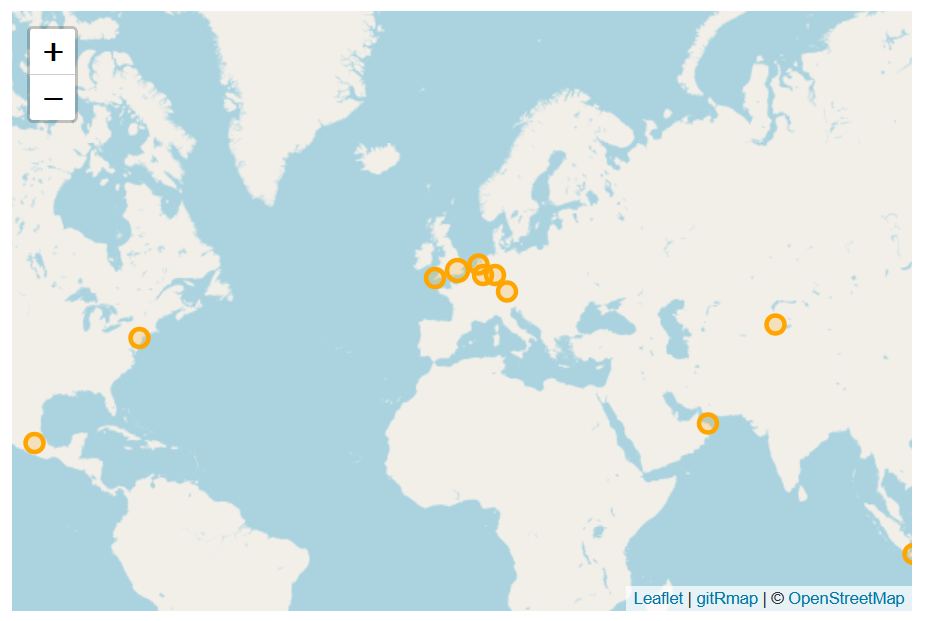

I'd like to introduce **gitRmap**: a semi-automated map of locations that you can add your own points to. It's designed for people who are new to GIS, but who know a little bit of Git.

You can create a map like the one below, with your own pins on it, just by following the quick start at [nickbearman.com/gitRmap](https://nickbearman.com/gitRmap/).

If you get stuck, I want to know! Message me, email me or [open an issue on GitHub](https://github.com/nickbearman/gitRmap/issues/new).

## What is gitRmap?

I wanted to create a tool that made it easier for more people to make maps. There are plenty of tools out there for creating a web map, but for someone new to GIS they can be pretty intimidating.

I was inspired by Michele Tobias's [Travelling GIS Chat Book map](https://github.com/MicheleTobias/traveling-gis-chat-book), set up in 2023. The structure of gitRmap is much the same, and I've hopefully made it easier to pick up and use.

## Where did gitRmap come from?

In April 2025, I was at the [Open Science Retreat](https://open.science-retreat.org/), where I was asked to create a web map showing a series of points with some pop-up text. That's a simple task for a GIS user — but the people asking weren't GIS users. They did, however, know Git. Rather than just making the map for them, I wanted to give them the tools to make it themselves. I tweaked the Travelling GIS Chat Book map to create the [Open Science Activism Map](https://nickbearman.com/open-science-activism-map/).
		
That did the job, but it wasn't really complete, and I didn't have time at the retreat to set everything up properly. So in December 2025, I applied for £500 from [OSGeo:UK's GoFundGeo](https://uk.osgeo.org/gofundgeo.html) to make it happen — and it was funded. Thanks, OSGeo:UK!

It's now all up and running, and I'd love for people to use it. Please spread the word!

## How do I use it?

In brief:

- Go to the [gitRmap repo]( https://github.com/nickbearman/gitRmap/).
- **Fork** it.
- Setup **GitHub Pages**.
- Add the points you want on your map to `data/locations.csv` - you don't need any coordinates, only a City and Country.
- Click **Commit**. GitHub Actions will *auto-magically* add coordinates to `locations.csv` and create the map - it will take about a minute.
- Go to `https://(username).github.io/gitRmap/` to see your map

There's more detail in the [quick start](https://nickbearman.com/gitRmap/), the [full tutorial](https://nickbearman.com/gitRmap-docs/), and a [setup video on YouTube](https://youtu.be/4L0VEnqRvwQ).

### What about different attributes, removing the popups, adding images or links?

All of this is doable — check out the [tutorial](https://nickbearman.com/gitRmap-docs) and the [options page](https://nickbearman.com/gitRmap-docs/options.html) for the details.

### Can I add polygons, multiple layers, or something else that isn't supported?

This tool is designed to keep things as simple as possible. I'm not planning to add multiple layers or polygons at this time.

## Got stuck or have a question? 

Check out the [FAQ section](https://nickbearman.com/gitRmap/), or drop me a [line](https://nickbearman.com).

If you ever want to talk about mapping or learning more about GIS, I'm always open to a discussion. Please [contact me](https://nickbearman.com) to find out more!
