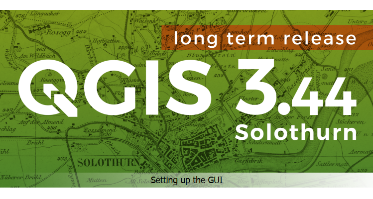

I offer ongoing GIS support for individuals and teams working with **QGIS** and **R**, so you have someone to turn to when things don't go to plan or you want a second pair of eyes on your approach.

*I help you get unstuck, work efficiently, and build confidence in your own GIS skills along the way.*

Whether you need a one-off fix for a tricky problem or ongoing help as you work through a project, I can offer support that fits around your needs.

---

::: columns
:::: {.column width="45%"}

::::
:::: {.column width="10%"}

::::
:::: {.column width="45%"}

::::
:::

---

### Ad-hoc Support

Sometimes you just need a quick answer or a second opinion. This could be:

- **Troubleshooting** — your map won't render, a script throws an error, a join isn't matching or something else.
- **Workflow review** — checking whether your approach in QGIS or R is sound before you commit hours to it.
- **Quick questions** — a short call or email exchange to point you in the right direction.

This works well if you have a specific problem to solve and want it resolved without committing to a longer engagement.

---

### Ongoing Support

For more involved or long-running projects, I can provide support on a regular basis, for example:

- A standing arrangement (e.g. a few hours per month) so you always have someone to call on when you need to.
- Support throughout your project, from initial data wrangling through to final map production or analysis.
- Help building and refining reproducible R workflows, or using Model Designer in QGIS.
- Developing more advanced QGIS or R skills within a team.

This suits teams or individuals who want continuity, rather than starting from scratch with someone new each time they get stuck.

:::{.callout-tip}
## West Dorset Wilding
“Everyone in the team really enjoyed working with Nick and has really appreciated his prompt responses and the clear and efficient communication he provided. He was a great help when completing a complicated and time restricted project. We speak very highly of Nick here in the office!”  
*Anna Wiscombe, Project Administrator*  
*Nick Gray, Landscape Recovery Project Officer - Land*  
*Dr Sam Rose, Executive Director*
:::

---

### How it works

Support can be delivered remotely by **email**, **video call**, or **screen-sharing session**, whatever suits the problem and how you like to work. I can also work directly with your data (subject to a data sharing agreement where needed).

As with my [consultancy](https://nickbearman.com/consultancy.html) work, pricing depends on the nature and length of support required. Please [contact me](https://nickbearman.com/index.html) to discuss what you need and get a quote.

---

:::{.callout-tip}
## Melissa Harrold, Project Assistant, Yeo Valley
"I liked how (the session) was tailored to our needs and accessible. Thank you so much! Very friendly and patient."
:::

 Code Sprint, thanks to Felipe Barros for the photo](blog/2025-01-foss4g-belem-brazil/code-sprint-felipe.jpeg)

---

I have also previously worked with a wide range of organisations including National Trails UK, Red Bull, and the University of Portsmouth — see [consultancy](https://nickbearman.com/consultancy.html) for more details and feedback from these projects.

---
 
 
::: columns
:::: {.column width="45%"}

::::
:::: {.column width="10%"}

::::
:::: {.column width="45%"}

::::
:::

---

If you're looking for structured teaching rather than problem-solving support, take a look at my [training courses](https://nickbearman.com/training-courses.html) and [training materials](https://nickbearman.com/training-materials.html). If you have a larger project you'd like help designing or delivering, see my [consultancy](https://nickbearman.com/consultancy.html) page. If you are not sure [reach out](https://nickbearman.com/index.html) and I will see how I can help you. 

